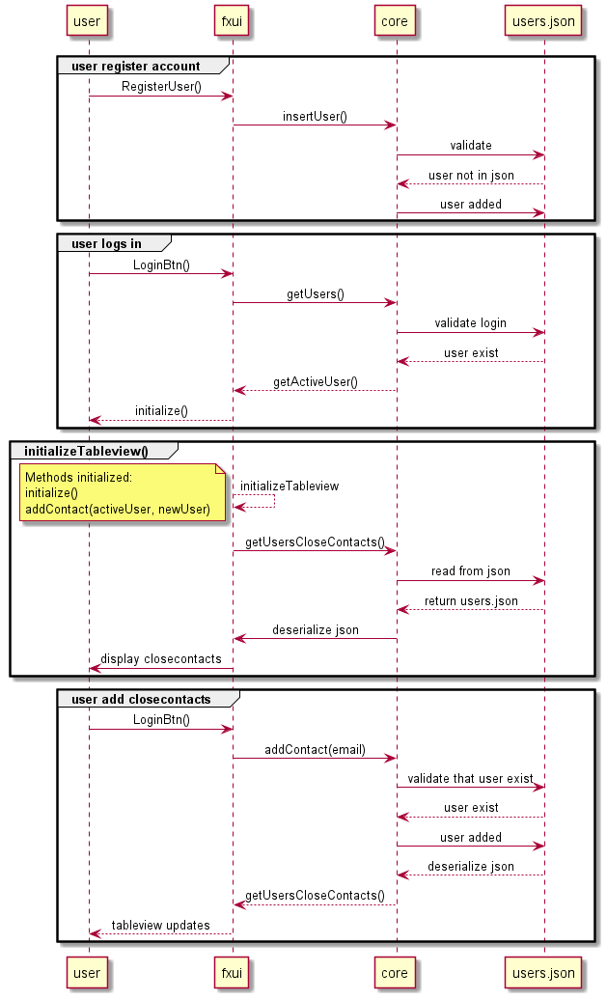
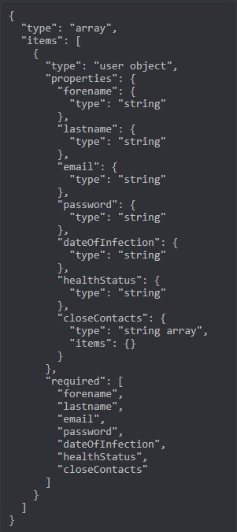

# Infectiontracer

Målet med denne applikasjonen er å gi enkeltpersoner en oversikt over deres nærkontakter, samt varslinger dersom noen av de tester positivt på coronavirus. Dette gjøres ved å registrere en bruker, og deretter legge inn nærkontakter som senere kan varsles.

## Filstruktur

De ulike filene er fordelt i ulike mapper.  

FXML-filer finner man under [fxui/src/main/resources/infectiontracer/ui](fxui/src/main/resources/infectiontracer/ui/).  
Kontrollere finner man i mappen [fxui/src/main/java/infectiontracer/ui](fxui/src/main/java/infectiontracer/ui/).  
Kjernelogikk finner man i mappen [core/src/main/java/infectiontracer/core](core/src/main/java/infectiontracer/core/).  
Json-klasse finner man i mappen [core/src/main/java/infectiontracer/json](core/src/main/java/infectiontracer/json/).  

Test-filer for fxui finner man under [fxui/src/test/java/infectiontracer/ui](fxui/src/test/java/infectiontracer/ui/).  
Test-filer for core klasser finner man under [core/src/test/java/infectiontracer/core](core/src/test/java/infectiontracer/core/).  

Foreløpig release plan for release 1 og 2 finnes under [docs](docs).  

# Brukerhistorier

- Som Navn Navnesen som er smittet av koronaviruset, vil jeg opprette meg en konto slik at jeg får tilgang til å bruke applikasjonen.

- Som Navn Navnesen ønsker jeg tilbakemelding dersom noe går feil i applikasjon.

- Som Navn Navnesen ønsker jeg muligheten til å legge til nærkontakter.

- Som Navn Navnesen ønsker jeg muligheten til å varsle nærkontakter ved smitte.

- Som Navn Navnesen ønsker jeg beskjed dersom av noen av mine nærkontakter tester positivt.

- Som Navn Navnesen vil jeg ha muligheten til å friskmelde meg etter påvist smitte. 

- Som Navn Navnesen vil jeg ha en applikasjon som er intuitiv og brukervennlig. 

# Illustrasjoner

**Her er noen bilder av selve applikasjonen.**

 - Applikasjonen ved oppstart.  

- Man må registrere seg ved manglende brukerkonto.

- Selve applikasjonen hvor en bruker kan administrere sine nærkontakter, og gi beskjed ved smitte. 

- Profilsiden hvor en bruker kan redigere fornavn, etternavn og passord, og slette brukerkontoen sin.

# Diagrammer

**Sekvensdiagram**

# Json-Skjema

