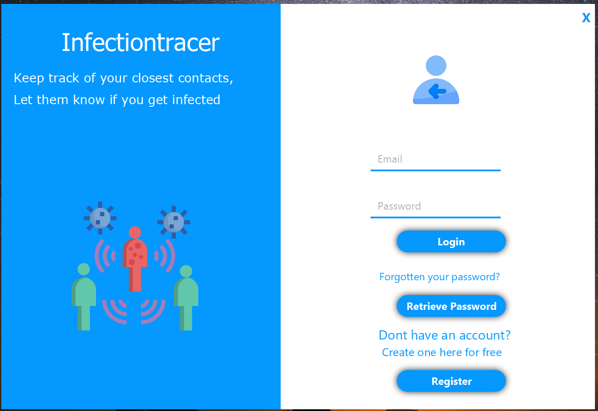
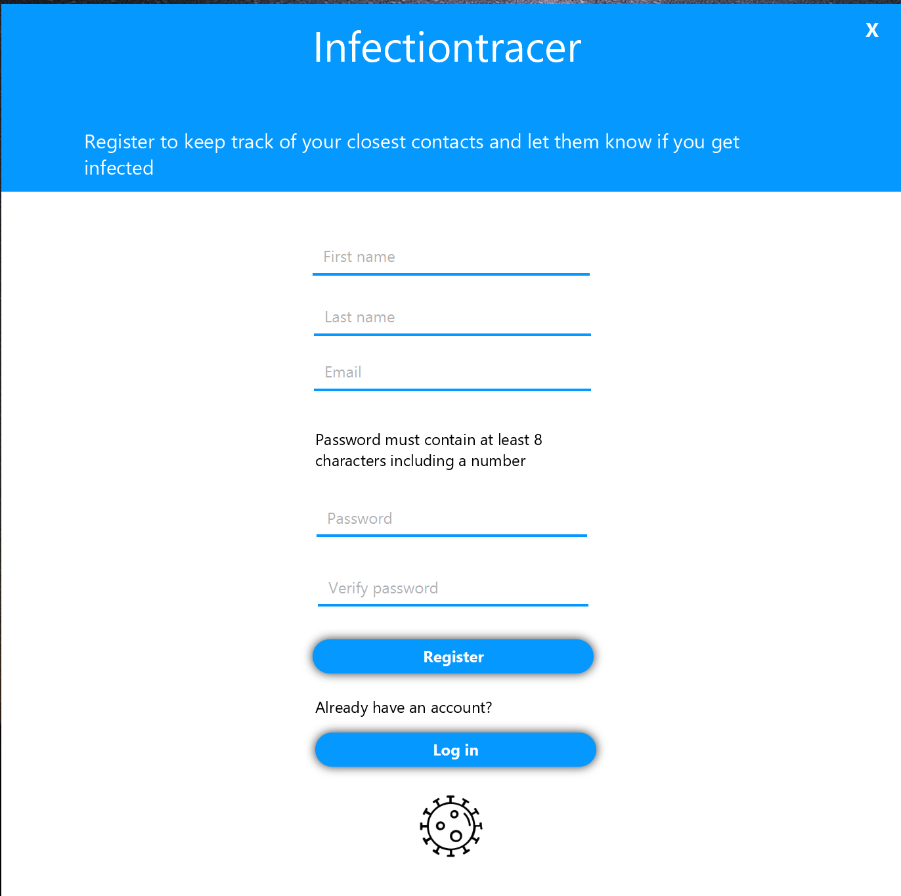
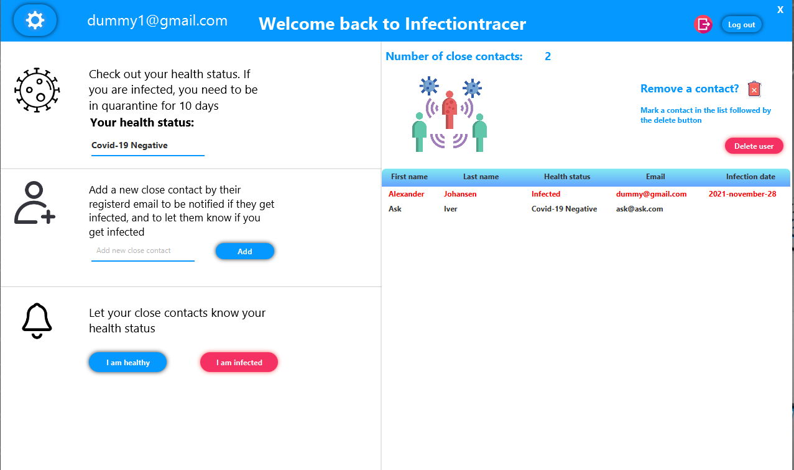
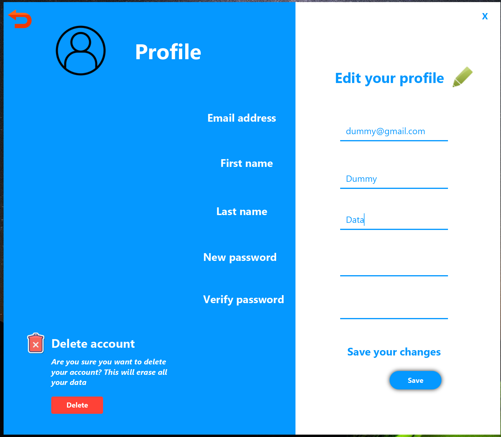
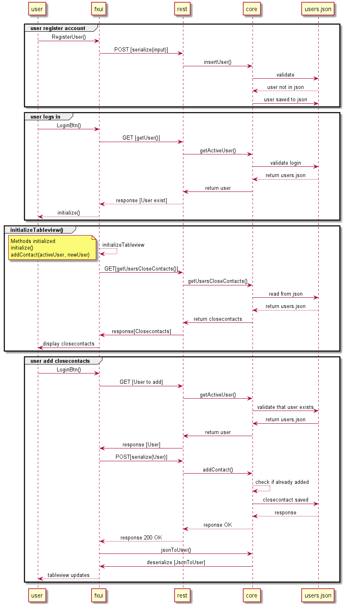

# Infectiontracer

Målet med denne applikasjonen er å gi enkeltpersoner en oversikt over deres nærkontakter, samt E-post varsel dersom noen av de tester positivt på coronavirus. Dette gjøres ved å registrere en bruker, og deretter legge inn nærkontakter som senere kan varsles. Man kan fjerne nærkontakter dersom en kontakt ikke lengre er nærkontakt, eller ved å legge til en person ved en feil. Man kan også endre personalia, passord og/eller slette brukerkontoen sin. 

## Filstruktur

De ulike filene er fordelt i ulike mapper.  

FXML-filer finner man under [fxui/src/main/resources/infectiontracer/ui](fxui/src/main/resources/infectiontracer/ui/).  
Kontrollere finner man i mappen [fxui/src/main/java/infectiontracer/ui](fxui/src/main/java/infectiontracer/ui/).  
Kjernelogikk finner man i mappen [core/src/main/java/infectiontracer/core](core/src/main/java/infectiontracer/core/).  
Json-klasse finner man i mappen [core/src/main/java/infectiontracer/json](core/src/main/java/infectiontracer/json/).  
Rest-tjenesten finner man i mappen [rest/src/main/java/infectiontracer/rest](rest/src/main/java/infectiontracer/rest/).  

Test-filer for fxui finner man under [fxui/src/test/java/infectiontracer/ui](fxui/src/test/java/infectiontracer/ui/).  
Test-filer for core klasser finner man under [core/src/test/java/infectiontracer/core](core/src/test/java/infectiontracer/core/).  
Integrasjonstester finner man under [integrationtests/src/test/java/infectiontracer/ui](integrationtests/src/test/java/infectiontracer/ui/).  
Test-filer for rest-tjenesten finner man under [rest/src/test/java/infectiontracer/ui](rest/src/test/java/infectiontracer/ui/).  

Foreløpig release plan for release 1 og 2 finnes under [docs](docs).  

**API-dokumentasjon** av REST-tjenesten finner du [her](https://documenter.getpostman.com/view/14944616/UVJYHySS?fbclid=IwAR0qR2jcDQGa54JkL8ySvVE5ZJCRAWiQy8QLyaC8vfphxTTRo-owYuh9gB0).  

# Brukerhistorier

- Som Navn Navnesen som er smittet av koronaviruset, vil jeg opprette meg en konto slik at jeg får tilgang til å bruke applikasjonen.

- Som Navn Navnesen ønsker jeg tilbakemelding dersom noe går feil i applikasjon.

- Som Navn Navnesen ønsker jeg muligheten til å legge til nærkontakter.

- Som Navn Navnesen ønsker jeg muligheten til å varsle nærkontakter ved smitte.

- Som Navn Navnesen ønsker jeg beskjed dersom av noen av mine nærkontakter tester positivt.

- Som Navn Navnesen vil jeg ha muligheten til å friskmelde meg etter påvist smitte. 

- Som Navn Navnesen vil jeg ha en applikasjon som er intuitiv og brukervennlig. 

# Illustrasjoner

**Her er noen bilder av selve applikasjonen.**

 - Applikasjonen ved oppstart.  

- Man må registrere seg ved manglende brukerkonto.

- Selve applikasjonen hvor en bruker kan administrere sine nærkontakter, og gi beskjed ved smitte. 

- Profilsiden hvor en bruker kan redigere fornavn, etternavn og passord, og slette brukerkontoen sin.

# Diagrammer

**Sekvensdiagram**

